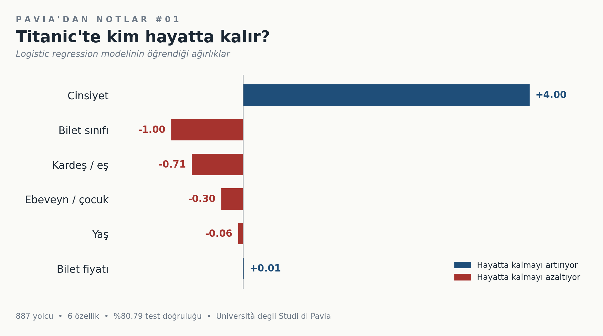

# 🚢 Pavia'dan Notlar #01 — Titanic'te kim hayatta kalır?

1912 Titanic kazasının gerçek yolcu verisi üzerinde **logistic regression** ile bir hayatta kalma tahmin modeli.

**🚀 Canlı demo:**  https://huggingface.co/spaces/HakanGurhan/titanic-survival



---

## 🎯 Projenin amacı

Bu basit bir tahmin modelinden fazlasıdır: logistic regression'ın **yorumlanabilir** olmasından yararlanarak hangi özelliklerin hayatta kalmaya ne kadar etki ettiğini ortaya çıkarmak. Karmaşık bir nöral ağ daha yüksek doğruluk verebilirdi ama "modelin neyi öğrendiğini" göremezdik.

---

## 📊 Veri

| | |
|---|---|
| Kaynak | Titanic veri seti (1912 yolcu kayıtları) |
| Toplam örnek | 887 |
| Eğitim | 710 |
| Test | 177 |
| Özellik sayısı | 6 |

### Kullanılan özellikler

| Özellik | Açıklama | Aralık |
|---|---|---|
| `Pclass` | Bilet sınıfı | 1 (lüks) – 3 (ekonomi) |
| `Sex` | Cinsiyet | 0 = erkek, 1 = kadın |
| `Age` | Yaş | 0 – 80 |
| `SibSp` | Gemideki kardeş veya eş sayısı | 0 – 8 |
| `Parch` | Gemideki ebeveyn veya çocuk sayısı | 0 – 6 |
| `Fare` | Bilet fiyatı (1912 sterlini) | 0 – 500+ |

---

## 🧠 Model

PyTorch ile **sıfırdan yazılmış** logistic regression — herhangi bir hazır modül (`nn.Linear`, `nn.LogisticRegression` vb.) kullanılmadan. Amaç işin altında yatan matematiği görmek.

```python
def logreg_inference(w, b, X):
    logits = X @ w + b
    p = torch.sigmoid(logits)
    return p
```

| Hiperparametre | Değer | Neden? |
|---|---|---|
| Loss function | Binary Cross-Entropy | İkili sınıflandırma için standart |
| Optimizer | SGD | Logistic regression için yeterli, gradient'ları net görmek için |
| Learning rate | 0.01 | Kararlı yakınsama için |
| Steps | 20.000 | Loss eğrisi plato yapana kadar |

---

## 📈 Sonuçlar

### Performans

| Metrik | Değer |
|---|---|
| Train accuracy | **81.13%** |
| Test accuracy | **80.79%** |
| Generalization gap | 0.34% |

Modelin train ve test doğruluğu birbirine çok yakın — ne overfitting ne underfitting. Logistic regression bu veri seti için doğal bir tavan değere ulaşmış.

### Öğrenilen ağırlıklar

| Özellik | Ağırlık | Etki |
|---|---:|---|
| **Cinsiyet** | **+3.99** | 🟢 Çok güçlü pozitif |
| **Bilet sınıfı** | **-0.99** | 🔴 Güçlü negatif |
| Kardeş/eş | -0.71 | 🔴 Negatif |
| Ebeveyn/çocuk | -0.30 | 🔴 Hafif negatif |
| Yaş | -0.06 | ⚪ İhmal edilebilir |
| Bilet fiyatı | +0.01 | ⚪ İhmal edilebilir |
| Bias | +1.21 | |

### Ana bulgu

**Cinsiyetin ağırlığı diğer beş özelliğin mutlak değer toplamından (2.09) büyük.** Yani modelin gözünden bu veri setinde tek başına cinsiyet, geri kalan her şeyden daha belirleyici. "Önce kadınlar ve çocuklar" politikası verinin içine bu kadar net işlemiş.

İkinci sırada bilet sınıfı geliyor — üst güvertedeki yolcular cankurtaran botlarına daha yakındı.

Yaşın bu kadar düşük etkili çıkması ilk başta sürprizdi. Hipotez: "kadınlar ve çocuklar" politikası "çocuk" boyutuyla zaten cinsiyet sinyaline karışmış olabilir; ayrıca yaş veri setinde geniş bir aralıkta dağılırken etiket sinyali zayıf kalıyor.

---

## 📂 Dosyalar

| Dosya | İçerik |
|---|---|
| `Homework1_Titanic.ipynb` | Baştan sona model eğitimi ve analiz |
| `app.py` | Gradio demo uygulaması |
| `model_weights.json` | Eğitilmiş `w` ve `b` parametreleri |
| `requirements.txt` | Bağımlılıklar |

---

## ▶️ Lokal olarak çalıştırmak

```bash
pip install -r requirements.txt
python app.py
# Tarayıcıda http://localhost:7860 açılır
```

Modeli yeniden eğitmek için `Homework1_Titanic.ipynb`'i çalıştırın — sonunda yeni bir `model_weights.json` üretilir.

---

## 🔍 Sınırlar ve geliştirme yönleri

- **Doğrusal model:** Logistic regression özellikler arası etkileşimleri (örn. *çocuk × bilet sınıfı*) yakalayamaz. SVM (RBF kernel) veya küçük bir MLP daha yüksek doğruluk verebilir.
- **Özellik normalizasyonu:** `Fare` aralığı çok geniş (0–500), diğerleri 0–10 civarında. StandardScaler ile normalize edildiğinde gradient descent daha kararlı olur, hatta daha düşük loss'a ulaşılabilir.
- **Eksik veriler:** Orijinal Titanic veri setinde `Age` sütununda eksikler var; bunlar median ile dolduruldu, daha akıllı bir imputation iyileşme getirebilir.
- **Yeni özellikler:** `FamilySize = SibSp + Parch`, `IsAlone`, `Title` (isimden çıkarılmış unvan) gibi türetilmiş özellikler eklenebilir.

---

## 📄 Lisans

MIT
